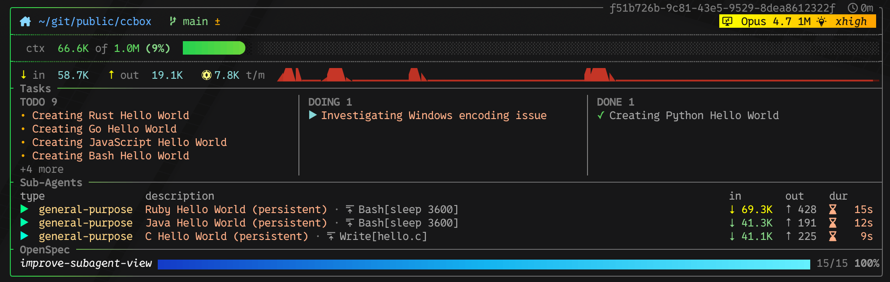

# ccbox

A fast, Rust statusline for [Claude Code](https://claude.com/claude-code) — drawn under every prompt. It surfaces what's actually relevant during a session: which model you're on, context-window burn, session tokens and cost, in-flight tasks and subagents, OpenSpec progress, and your active Python venv — themed and configurable from your shell rc.




## Features

- **Model identity** — see which Claude model the session is on at a glance.
- **Context-window burn** — tokens in the window, percentage of the window used, and a progress bar.
- **Usage limits** — 5-hour session and weekly subscription limits with time until reset.
- **Tokens & cost** — input / output token totals and per-session / per-day spend (auto-hidden for subscription accounts).
- **Tasks** — todo / doing / done counts inline, or a multi-column kanban **board** view for wider terminals.
- **Subagents** — in-flight subagent activity from the current session.
- **OpenSpec progress** — bars and counts when there's an active OpenSpec change.
- **Python venv** — name of the activated venv shown on the top row, when present.
- **Theming** — multiple built-in themes, switchable from an env var or `--theme`.

## Requirements

- **macOS (Apple Silicon or Intel) or Linux (x86_64 or aarch64)** — each release ships a prebuilt binary for these; the Linux ones are static (musl), so any distribution works. On other platforms, or to build from source, you need **a Rust toolchain** (stable, 1.85+) from [rustup](https://rustup.rs/).
- **curl, tar and sha256sum or shasum** for the installer. It no longer needs python3; the uninstaller still does.
- **Claude Code** — ccbox runs as Claude Code's `statusLine` subprocess. Install from [claude.com/claude-code](https://claude.com/claude-code).
- **A [Nerd Font](https://www.nerdfonts.com/)** in your terminal — ccbox uses glyphs (folder, branch, model, task icons, etc.) that **only render correctly with a Nerd Font**. Without one, you'll see boxes / question marks in place of the glyphs; that's the typical "it looks broken" failure mode.

## Install

```bash
curl -fsSL https://raw.githubusercontent.com/tom-ha/ccbox/main/install.sh | bash
```

This downloads the prebuilt binary for your platform from the [latest release](https://github.com/tom-ha/ccbox/releases/latest), checks its SHA-256 against the release's `SHA256SUMS`, and installs it as `~/.cargo/bin/ccbox`. A checksum mismatch stops the install. With no prebuilt binary for your platform, or no release yet, it builds from source with `cargo install` instead (about a minute). It then runs `ccbox setup`, which patches `~/.claude/settings.json` so Claude Code invokes `ccbox` as its statusline (refreshing every 5s) and runs `ccbox hook` for the "needs you" row. Re-running it is safe; other hooks are left alone, and `settings.json` is only rewritten, after a backup to `settings.json.bak.YYYYMMDD-HHMMSS`, when something changes. Restart Claude Code afterwards.

| Variable | Default | What it does |
|---|---|---|
| `CCBOX_BIN_DIR` | `~/.cargo/bin` | Where the prebuilt binary goes. Pass the same value to the uninstaller. |
| `CCBOX_BUILD_FROM_SOURCE` | unset | `1` builds with `cargo install` even when a prebuilt binary exists (into cargo's install root, `CARGO_INSTALL_ROOT` or `~/.cargo`). |
| `CCBOX_RELEASES_URL` | `https://api.github.com/repos/tom-ha/ccbox` | Where releases are read from (a GitHub API repository URL), for forks and testing. `ccbox update` and the update check honour it too. |
| `CCBOX_REPO_URL` / `CCBOX_REPO_BRANCH` | this repo / `main` | What a source build compiles when the script is piped from curl. From a local checkout it builds the working tree. |

Want to read the script before running it? Fetch the same URL without the `| bash` to inspect it (`curl -fsSL https://raw.githubusercontent.com/tom-ha/ccbox/main/install.sh`).

If you'd rather not pipe a script to bash, download `ccbox-<version>-<target>.tar.gz` and `SHA256SUMS` from the [releases page](https://github.com/tom-ha/ccbox/releases), check it with `shasum -a 256 -c SHA256SUMS --ignore-missing`, extract `ccbox` somewhere on your `PATH`, and let it wire itself up:

```bash
tar -xzf ccbox-*-aarch64-apple-darwin.tar.gz -C ~/.cargo/bin ccbox
~/.cargo/bin/ccbox setup
```

On macOS, a tarball downloaded with a browser carries the quarantine attribute, and Gatekeeper refuses to run the unsigned binary. Clear it with `xattr -d com.apple.quarantine ~/.cargo/bin/ccbox`. (The installer and `ccbox update` download with curl and ureq, which set no quarantine attribute.)

To build from source instead: `cargo install --git https://github.com/tom-ha/ccbox.git --locked`, then run `ccbox setup`.

### Uninstall

```bash
curl -fsSL https://raw.githubusercontent.com/tom-ha/ccbox/main/uninstall.sh | bash
```

This unwires `statusLine` and the ccbox hooks from `~/.claude/settings.json` (only a statusline that points at a ccbox binary — a foreign statusline is left alone), removes ccbox's files under `~/.claude` (the `ccbox-subscription` marker and the `ccbox-cache/` directory), and removes the binary: `cargo uninstall ccbox` for a source build, and `~/.cargo/bin/ccbox` (or `$CCBOX_BIN_DIR/ccbox`) for a prebuilt one. Your `settings.json` is backed up to `settings.json.bak.YYYYMMDD-HHMMSS` first. Restart Claude Code afterwards.

### Install via the Claude Code plugin

You can also install ccbox from inside Claude Code. Add this repo as a plugin marketplace, install the `ccbox` plugin, then ask Claude to "install ccbox" — the plugin's `install-ccbox` skill runs the same one-liner and verifies `command -v ccbox` resolves and `settings.json` was patched.

```text
/plugin marketplace add tom-ha/ccbox
/plugin install ccbox@ccbox
```

## Quick start

After installing, **fully restart Claude Code** (the statusline is wired up at startup). On the next prompt you should see the multi-line box appear underneath, with your repo path, branch, model, and a context bar — much like the example up top.

Want to tweak something straight away? Two one-liners worth trying first:

```bash
export CLAUDE_STATUSLINE_THEME=tokyonight   # try a different theme
export CCBOX_DENSITY=verbose                # show every available row
```

Restart Claude Code after changing env vars — the statusline subprocess inherits its environment from the Claude Code parent, so changes only take effect on the next launch. See **Customize** below for the full list of knobs.

## Updating

Once a day at most, in the background, ccbox asks GitHub for the latest release. When it is newer than the installed binary, the statusline's bottom border says so:

```
╰──────────────────────────────── ⬆ ccbox 0.7.0 available · run ccbox update ╯
```

On narrow terminals it shortens to `⬆ ccbox 0.7.0 · ccbox update`, then `⬆ ccbox 0.7.0`. Then run:

```bash
ccbox update
```

It downloads the release for your platform, refuses it unless its SHA-256 matches the release's `SHA256SUMS`, checks that it runs, and swaps it in with a single rename, so the binary is always either the old one or the new one. Then the new version rewires `settings.json` for itself (adding any hook a new version needs, with a backup first), and `ccbox update` prints `<old> -> <new>`, what changed in `settings.json`, and the release notes. That is all: running sessions pick up the new binary on their next render. When you are already current, `ccbox update` still checks the wiring and repairs it if something is missing.

| Flag | What it does |
|---|---|
| `--check` | Only reports: `0.6.0 -> 0.7.0 available`, `already on 0.7.0`, or that no release is published yet. Writes nothing. |
| `--version X.Y.Z` | Installs that release instead of the latest. |
| `--force` | Allows `--version` to go to an older release. |

If the binary lives in a directory you can't write to (say `/usr/local/bin`), `ccbox update` stops and says so; re-run the installer, or use `sudo ccbox update`.

The check runs in a detached `ccbox` process with a 10 s timeout, so the statusline never waits on the network. Its result is cached in `<claude_dir>/ccbox-cache/update-check.json`, shared by every session on the machine; a failed check waits twice as long each time, up to a week. `ccbox status` shows the installed version, the latest release it knows about, and whether the check is on.

| Variable | Default | What it does |
|---|---|---|
| `CCBOX_UPDATE_CHECK` | on | `0`/`false`/`no`/`off` turns the background check and the chip off entirely: no process, no network call. `ccbox update` still works when you run it. Like every env var, it takes effect after a Claude Code restart. |
| `CCBOX_RELEASES_URL` | `https://api.github.com/repos/tom-ha/ccbox` | Where releases are read from. |

## Customize

ccbox reads configuration entirely from environment variables — exported in your shell rc so they're inherited by the Claude Code process and forwarded to the statusline subprocess. There is no config file.

### Width and theme

| Variable | Default | What it does |
|---|---|---|
| `CCBOX_MAX_WIDTH` | `140` | Caps rendered width in columns. |
| `CCBOX_FULL_WIDTH` | unset | If set (any value), renders at the full terminal width instead of capping at `CCBOX_MAX_WIDTH`. |
| `CLAUDE_STATUSLINE_THEME` | unset | Theme name. Run `ccbox --help` or browse [`src/theme/builtin.rs`](src/theme/builtin.rs) for the full list. |

Equivalent CLI flags: `--width`, `--full-width`, `--theme NAME`, `--bg-shift warm|cool`.

### Density preset

The density preset controls which **event-driven** rows participate in the rendered box. Each event-driven row still requires its own content to be present (e.g. tasks only render when the session has a TaskList) — the preset gates *which* of those rows are allowed to render at all.

| Variable | Default | Values |
|---|---|---|
| `CCBOX_DENSITY` | `standard` | `minimal` · `standard` · `verbose` |

- `minimal` — only the top row (path/branch/venv/model), the context line, and the tokens/cost line. No tasks, no subagents, no openspec, no plugins/skills, even when present.
- `standard` (default) — adds the task row, subagent rows, and OpenSpec bars when there is content for each.
- `verbose` — same as standard plus the plugins+skills summary row when present.

```bash
export CCBOX_DENSITY=minimal  # quietest
export CCBOX_DENSITY=verbose  # show everything you've got
```

For finer-grained control over just the tasks or subagents row — including a `/ccbox` slash command that toggles without restarting Claude Code — see **Per-row toggles** below.

### Per-row toggles

The density preset above is all-or-nothing across the four event-driven rows. When you want to hide *just* the tasks row or *just* the subagents row, use these per-row controls instead.

| Variable | Default | What it does |
|---|---|---|
| `CCBOX_SHOW_TASKS` | unset | `1`/`true`/`yes`/`on` forces the tasks row visible (even under `CCBOX_DENSITY=minimal`). `0`/`false`/`no`/`off` hides it (even under `standard`/`verbose`). Unset = fall through to the density preset. |
| `CCBOX_SHOW_SUBAGENTS` | unset | Same shape, for the subagents row. |

```bash
export CCBOX_SHOW_TASKS=0      # always hide the tasks row
export CCBOX_SHOW_SUBAGENTS=1  # always show subagents (when present)
```

#### Runtime toggle without a restart

Env vars only take effect on the next Claude Code launch. For live toggling, ccbox reads a small JSON file on every render and uses it to override the env vars for that session.

| Path | Shape |
|---|---|
| `<claude_dir>/ccbox-toggles.json` | `{ "show_tasks": false, "show_subagents": true }` |

Both keys are optional. Missing file, empty file, malformed JSON, and permission errors are all treated as "no overrides" silently — no warning, no panic. The file is written atomically (tempfile + rename), so concurrent processes never observe a half-written file.

The `/ccbox` slash command (shipped with the plugin, mirrored under this repo's `.claude/commands/ccbox.md`) edits the file for you:

```text
/ccbox show tasks         # force tasks row visible
/ccbox hide subagents     # force subagents row hidden
/ccbox flip tasks         # invert current effective visibility
/ccbox status             # report each row's current visibility and source
```

The slash command runs `ccbox` with the same arguments, so the commands work directly too:

```bash
ccbox show tasks
ccbox hide subagents
ccbox flip tasks
ccbox status
```

`status` prints a small table showing each row's resolved visibility and which precedence layer made the call, then the version information:

```
row         visible  source
tasks       false    state_file
subagents   true     env

installed     0.6.0
latest        0.6.0 (checked 2026-10-01 09:12)
update check  on
```

#### Precedence

For each of the tasks and subagents rows, visibility resolves in this order — the first layer with an opinion wins:

1. **State file** (`<claude_dir>/ccbox-toggles.json`) — the most recent / most interactive signal.
2. **Env var** (`CCBOX_SHOW_TASKS` / `CCBOX_SHOW_SUBAGENTS`) — the persistent baseline.
3. **Density preset** (`CCBOX_DENSITY`) — the broad default.

Then AND with content presence — a row is never rendered when its content is empty, regardless of overrides.

Heads-up: `/ccbox flip <row>` always persists the inverse of the *current effective* value, which can override an env var you set in your rc. If `/ccbox status` shows `source: state_file` and you'd rather follow your env var or density again, delete that key from `ccbox-toggles.json` (or remove the whole file).

The `--snapshot` output exposes the resolved visibility and source under `env.row_visibility`, useful for debugging "why isn't this row rendering?":

```bash
ccbox --snapshot < session.json | jq '.env.row_visibility'
```

### Tasks view (inline vs. board)

| Variable | Default | Values |
|---|---|---|
| `CCBOX_TASKS` | `board` | `board` · `inline` |

- `board` (default) — the task row is a multi-line kanban board with three columns (TODO / DOING / DONE), bullets per column, up to five tasks per column, and a `+N more` overflow indicator. Auto-degrades to inline below 100 columns.
- `inline` — the task row is a single-line kanban: `todo N   ▶ doing N  <active-subject>   done N ✓`.

```bash
export CCBOX_TASKS=inline
```

### Cost cell

| Variable | Default | What it does |
|---|---|---|
| `CCBOX_SHOW_COST` | auto | `1`/`true` forces the `$X sess · $Y today` cost cell visible. `0`/`false` hides it. Unset → ccbox auto-detects: subscription sessions (those that report `rate_limits.five_hour.resets_at`) get cost hidden; API users keep cost visible. |

A persistent marker (`<claude_dir>/ccbox-subscription`) is written the first time ccbox sees populated `rate_limits`, so fresh sessions on a subscription account still get cost-hidden behaviour before the first message lands.

### Python venv indicator

If you launch Claude Code from inside an activated Python venv, ccbox shows the venv name on the top row, just to the left of the model identity:

```
│ 󰉋 ~/proj            󰌠 venv: py311 · 󰢹 Sonnet 4.6│
```

ccbox reads the venv name from these environment variables, in order:

| Variable | What it does |
|---|---|
| `VIRTUAL_ENV_PROMPT` | The short name (some venv tools and `uv` set this). Preferred when present. |
| `VIRTUAL_ENV` | The path to the active venv; ccbox displays the basename (e.g. `/opt/conda/envs/py311` → `py311`, `/Users/me/proj/.venv` → `.venv`). |

If neither is set, no venv slot is rendered. Activate the venv **before** starting Claude Code — ccbox runs as a subprocess of Claude Code and inherits the parent's environment, so activations done inside Claude Code's shell tools won't appear.

### Git cache

`GitInfo` (branch, ahead/behind, dirty markers) is shelled out to `git` on each render. To absorb the high frequency of statusline calls during streaming responses, results are cached on disk under `<claude_dir>/ccbox-cache/git/<hash>.json`.

| Variable | Default | What it does |
|---|---|---|
| `CCBOX_GIT_CACHE_TTL_MS` | `2000` | TTL in milliseconds for the cache. `0` disables caching. Stale or missing entries trigger a live read and a refresh of the cache file. |

The cache is per-cwd (FNV1a-hashed for a stable, filesystem-safe filename) and is refreshed atomically via a tempfile + rename, so concurrent ccbox processes don't clobber each other's entries.

### Reading the rows

- **Top border** — session ID and time since the session last wrote to its transcript.
- **Top row** — working directory, git branch with `N changed` (uncommitted files), `N ahead` / `N behind` (commits vs. upstream), and the model with its reasoning effort.
- **Needs you** — appears only while a session is waiting on you. This session shows a `⏸ NEEDS YOU` badge with what it's waiting for (`permission`, `question`, `your turn`) and for how long; every other waiting session on the machine is listed after it, so any terminal tells you which one is stuck. Driven by Claude Code hooks that `install.sh` registers: `ccbox hook` runs on `PermissionRequest`, `Notification`, and `PreToolUse` for `AskUserQuestion` to mark a session, and on `PostToolUse` / `PostToolUseFailure` / `PermissionDenied` / `SubagentStop` / `UserPromptSubmit` / `Stop` / `SessionEnd` to clear it. Each agent gets its own marker, so parallel subagents waiting at once are tracked separately, and a background subagent's prompt survives the main turn ending. When a session has several, the row shows a blocking prompt ahead of "your turn". A permission marker clears when that same call finishes or fails, or when the agent that asked moves on in its own transcript — which is also how a rejected prompt clears, since Claude Code fires no hook for a rejection. Entries clear themselves when the session's Claude Code process exits, when its transcript shows it has moved on, or — for `your turn`, shown dim because nothing is blocked — after 10 minutes; `permission` and `question` stay until answered. Claude Code hides the statusline during a permission prompt, so that session's own badge isn't visible then — the other terminals still show it.
- **Bottom border** — `⬆ ccbox <version> available · run ccbox update` when a newer release is out; see **Updating**.
- **ctx** — tokens currently in the context window, out of the model's window size, and the percentage of the full window used (Claude Code's own `used_percentage`). The colour turns warn/alert as you approach auto-compaction (~75% of the window).
- **Limits** — on Pro/Max subscriptions: the `session` (5-hour) and `week` (7-day) usage limits, plus per-model weekly limits such as `Fable` with their reset time (`resets 9:30am` within 24 hours — Claude Code's `/usage` threshold — else `resets Mon 12pm`). Each bar fills to the usage %, and a `│` marker shows where usage would be if you spread it evenly over the window. Fill past the marker (usage ahead of that even pace) is drawn red (`▓`). Usage is account-wide (all sessions, plus claude.ai); the marker is purely time. If your current rate would hit the limit before it resets, a red `maxed at ~Fri 1:15pm` forecast appears — from a line fitted through usage samples (logged by every session on this machine) over the last 30 minutes for the session limit and the last 24 hours for weekly limits, so nights and breaks count toward the weekly rate. The forecast stays hidden until there's enough real history: samples spanning at least 5 minutes for the session limit and 4 hours for weekly limits. A limit turns warn at 70%, when it's forecast to run out before reset, or when you're more than 10 points ahead of an even pace; it turns alert at 90%. Once a limit hits 100% and you continue on extra usage, an extra-usage cell appears. If the account data below isn't available, it falls back to an estimate (`~$X`): the list-price cost of everything since the limit was hit, summed across sessions until that window resets. Per-model limits and real extra-usage spend aren't in Claude Code's statusline data, so ccbox asks Claude Code for them: every 5 minutes at most, in the background, it runs `claude -p` with the SDK `get_usage` request — no prompt is sent, so no usage is consumed, and user settings are skipped so none of your hooks run and no transcript is saved. Results are cached in `<claude_dir>/ccbox-cache/account-usage.json` and shared by all sessions. With that data, the extra-usage cell shows your actual spend (`extra usage $130.96 of $500.00`) instead of the estimate. On API billing there are no limits, so the row shows input/output tokens and the `$ sess · $ today` cost cell instead.

### CLI flags

```
Usage:
  ccbox [--theme NAME] [--width COLS] [--full-width] [--bg-shift warm|cool] [--snapshot]
  ccbox show|hide|flip tasks|subagents
  ccbox status
  ccbox update [--check] [--version X.Y.Z] [--force]
  ccbox version
```

`ccbox --help` prints the full list, including the env-var reference; `ccbox --version` and `ccbox version` print the installed version. The `ccbox-demo` binary renders the bundled fixture at a progression of widths and theme variants — useful for previewing changes.

#### `--snapshot`

For diagnostics: instead of printing the ANSI-styled box, `--snapshot` writes a single JSON object to stdout containing the parsed `SessionInfo`, resolved `Env`, theme, layout selection, per-component visibility, and the computed values feeding the visible rows (model name, short pwd, branch, costs, fill ratio). No ANSI escapes are emitted.

```bash
ccbox --snapshot < session.json | jq '.composition.body'
ccbox --snapshot --width 100 < session.json | jq '.computed.session_cost_usd'
```

Useful for answering "why isn't this row rendering?" without reading source: the per-component `visible` flag in `composition.body` is the answer. `.update` holds the installed version, the cached latest release, when it was checked, and whether the update chip shows.

### Layouts

ccbox picks a layout based on the effective terminal width:

- **Narrow** (`< 55` cols): two-line content (path + branch on line 1, venv/model on line 2). Compact context line, no tokens-cost row.
- **Medium** (`55–79` cols): single-line content, single-percentage compact context line, tokens-cost row.
- **Wide** (`≥ 80` cols): full layout — top row, full context line with `tokens of window (pct%) bar`, tokens-cost row with augmented in/out labels and consolidated cost cell, plus event-driven rows (tasks/subagents/openspec/plugins-skills) gated by the density preset.

The CLI flag `--width COLS` lets you preview a specific size regardless of the actual terminal.

## Releasing

One version covers the binary, the plugin and the marketplace entry. To cut a release from an up-to-date `main`, with the changes listed under `## [Unreleased]` in `CHANGELOG.md`:

```bash
scripts/release.sh 0.7.0
git push origin main v0.7.0
```

`scripts/release.sh` refuses a dirty tree, an existing tag, or anything but `X.Y.Z`. It sets the version in `Cargo.toml`, `Cargo.lock`, `.claude-plugin/marketplace.json` (both fields) and `plugins/ccbox/.claude-plugin/plugin.json`, moves the `[Unreleased]` entries under `## [0.7.0] - <date>`, commits `release: v0.7.0` and creates the annotated tag. It pushes nothing.

The tag push is the approval. `.github/workflows/release.yml` checks that the tag and all four version fields agree and that `CHANGELOG.md` has a `## [0.7.0]` section, builds the four targets (`aarch64-apple-darwin`, `x86_64-apple-darwin`, `x86_64-unknown-linux-musl`, `aarch64-unknown-linux-musl`), packages each as `ccbox-0.7.0-<target>.tar.gz` holding only `ccbox`, writes `SHA256SUMS`, runs the tests, and publishes the GitHub Release with the changelog section as its notes. Every pull request that touches `src/`, `Cargo.*`, `scripts/` or the workflow runs the same build, packaging and checksums as a dry run, and publishes nothing.

## Contributing

PRs and issues welcome. The dev loop:

```bash
git clone https://github.com/<your-fork>/ccbox.git
cd ccbox
cargo test                  # run the test suite
cargo install --path .      # install your local build over the released one
```

## Acknowledgments

- Inspired by [yet-another-statusline](https://github.com/tmck-code/yet-another-statusline)
- Built for [Claude Code](https://claude.com/claude-code).
